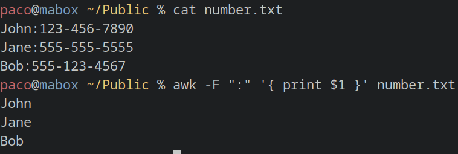

---

### **_Introduction_**

Hey there! As a Linux user, you might have heard about the powerful `AWK` command, but you might not be fully familiar with its capabilities. `AWK` is a text processing tool that can help you manipulate data in many ways. In this blog post, let's dive deep into the `AWK` command, explore its features, use cases, and some tips to help you master it.

### **_AWK Basics_**

`AWK` is a line-oriented programming language that can be used to search and manipulate text files. It operates by performing actions on each line of a file, based on the patterns specified in the command. The basic syntax of the `AWK` command is as follows:

```bash
awk 'pattern { action }' filename
```

The pattern can be a regular expression or a string and specifies the lines to which the action should be applied. The action can be any valid `AWK` command and is enclosed in braces {}. The filename is the name of the file to be processed.

### **_Printing Columns_**

One of the most common use cases for `AWK` is to extract columns from a file. The following command will print the first and second columns of a file separated by a comma:

```bash
awk '{ print $1 "," $2 }' people.txt
```


The `$1` and `$2` represent the first and second columns, respectively. The comma is added to separate the columns.

### **_Conditional Statements_**

`AWK` also supports conditional statements, such as if-else. The following command will print lines from a file that contain the word "error":

```bash
awk '/error/ { print }' people.txt
```


The pattern `/error/` specifies the lines that contain the word "error". The action `{ print }` prints those lines.

### **_Calculations_**

`AWK` can be used to perform calculations on data in a file. The following command will print the sum of the values in the third column of a file:

```bash
awk '{ sum += $3 } END { print sum }' people.txt
```


The sum variable is initialized to zero and then incremented by the value of the third column for each line. The `END` keyword specifies that the final action should be performed after all lines have been processed.

In addition to the basic features of `AWK`, there are many advanced features that can be used to manipulate data in powerful ways.

### **_Regular Expressions_**

`AWK` supports regular expressions, which can be used to search for patterns in text. The following command will print lines from a file that start with the word "error":

```bash
awk '/^error/ { print }' error.txt
```


The `^` symbol indicates the start of the line. The pattern `/^error/` specifies lines that start with the word "error".

### **_Field Separators_**

By default, `AWK` assumes that fields in a file are separated by colon. However, it is possible to specify a different field separator using the `-F` option. The following command will print the first column of a file that is separated by colon:

```bash
awk -F ":" '{ print $1 }' number.txt
```



The `-F` `":"` option sets the field separator to colon. The `$1` represents the first column.

### **_User-Defined Functions_**

`AWK` allows users to define their own functions, which can be used to perform custom data processing. The following command defines a function called "double" that multiplies a number by 2:

```bash
awk 'function double(x) { return x*2 } { print double($1) }' number.txt
```


The `function double(x)` takes an argument `x` and returns `x` multiplied by 2. The `{ print double($1) }` action applies the double function to the first column of each line.

### **_Conclusion_**

In this blog post, we have explored the `AWK` command in Linux, including its basic syntax, common use cases, and advanced features. With this knowledge, you can use `AWK` to manipulate data in a variety of ways. Don't forget to experiment with different patterns and actions to fully leverage the power of `AWK`. Good luck!

**_Thank you for reading_** 🧑‍💻

**_Stay tuned for more_** 🚀

✌️ and **_logout_**

<a href="https://www.buymeacoffee.com/k1lgor" target="_blank"></a>
